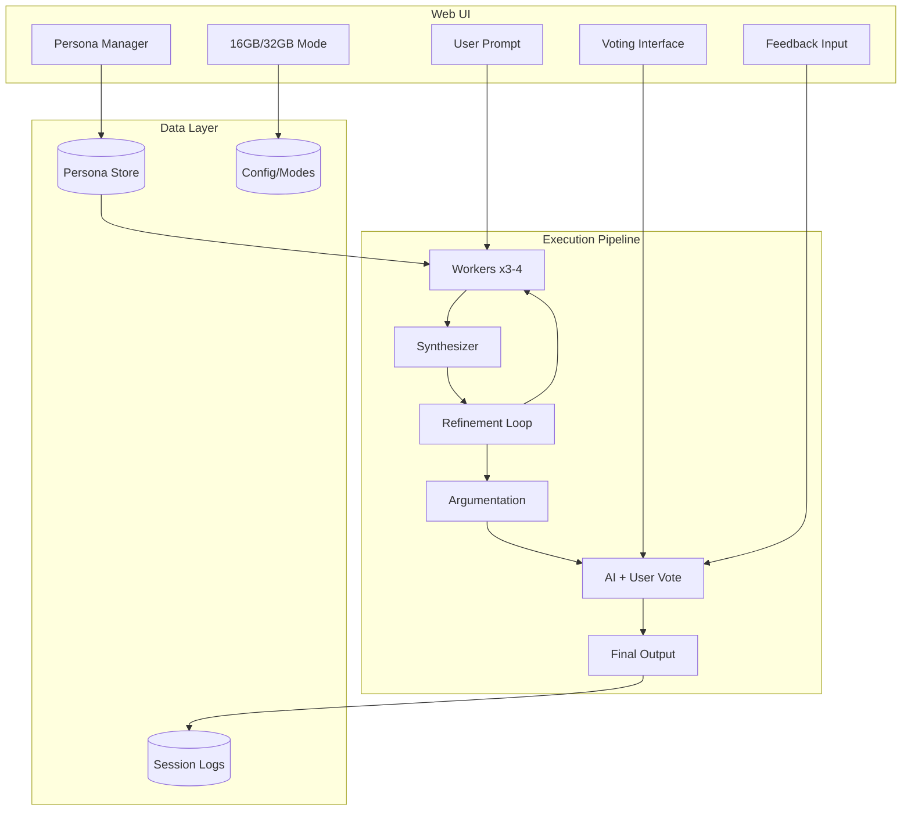

# AI Council – Complete System Plan

## System Overview

A local multi-agent debate system where 3-4 persona-driven workers generate diverse solutions, refine them through synthesis loops, argue their positions, and undergo collaborative AI+User voting to produce high-quality outputs with fine-tuning data.



---

## Hardware Modes

### 16GB Mode (Current)

| Component | Specification |

|-----------|---------------|

| Worker Models | 2B-3B (4-bit) |

| Synthesizer | 5B-6B (4-bit) |

| Worker Count | 2-3 |

| Context (Workers) | 2K tokens |

| Context (Synth) | 4K tokens |

| Model Unloading | Aggressive |

### 32GB Mode (After Upgrade)

| Component | Specification |

|-----------|---------------|

| Worker Models | 3B-4B (4-bit) |

| Synthesizer | 7B-8B (4-bit) |

| Worker Count | 3-4 |

| Context (Workers) | 4K tokens |

| Context (Synth) | 8K tokens |

| Model Unloading | Moderate |**Mode Selection**: UI toggle → saved to config, also readable via env var `AI_COUNCIL_RAM_MODE`---

## Web UI (Flask + Vanilla JS)

### Design Principles

- Lightweight, no heavy frameworks
- Single-page application feel
- Real-time updates via Server-Sent Events (SSE)
- Dark theme, clean typography
- Responsive panels

### Main Views

#### 1. Session View (Primary)

```javascript
┌─────────────────────────────────────────────────────────────┐
│  [16GB ▼]  AI Council                          [Settings ⚙] │
├─────────────────────────────────────────────────────────────┤
│ ┌─────────────────────────────────────────────────────────┐ │
│ │ Prompt Input                                    [Start] │ │
│ │ ____________________________________________            │ │
│ └─────────────────────────────────────────────────────────┘ │
├─────────────────────────────────────────────────────────────┤
│ Stage: Worker Drafts [████████░░] 3/4                       │
├────────────┬────────────┬────────────┬──────────────────────┤
│  Worker 1  │  Worker 2  │  Worker 3  │  Worker 4 (if 32GB)  │
│  [Persona] │  [Persona] │  [Persona] │  [Persona]           │
│  ───────── │  ───────── │  ───────── │  ─────────           │
│  Output... │  Output... │  Output... │  Output...           │
│            │            │            │                      │
│  [Swap ↻]  │  [Swap ↻]  │  [Swap ↻]  │  [Swap ↻]            │
└────────────┴────────────┴────────────┴──────────────────────┘
```


#### 2. Voting View

```javascript
┌─────────────────────────────────────────────────────────────┐
│  Voting Phase                                               │
├─────────────────────────────────────────────────────────────┤
│  Candidate 1: [Worker 1 - "Analyst"]                        │
│  ┌─────────────────────────────────────────────────────────┐│
│  │ "Why this is best": [Worker's argument]                 ││
│  │ ─────────────────────────────────────────────────────── ││
│  │ Output: [Full proposal]                                 ││
│  └─────────────────────────────────────────────────────────┘│
│  AI Score: 7.5/10  │  Your Vote: [●1 ○2 ○3 ○Skip]          │
│  ┌─────────────────────────────────────────────────────────┐│
│  │ Your feedback (optional): _________________________     ││
│  └─────────────────────────────────────────────────────────┘│
│  [◀ Prev]                                        [Next ▶]   │
├─────────────────────────────────────────────────────────────┤
│  [Submit Votes]                                             │
└─────────────────────────────────────────────────────────────┘
```


#### 3. Persona Manager View

```javascript
┌─────────────────────────────────────────────────────────────┐
│  Persona Manager                              [+ New] [Import]│
├─────────────────────────────────────────────────────────────┤
│  ┌──────────────┐  ┌──────────────┐  ┌──────────────┐       │
│  │ ◉ Analyst    │  │ ○ Creative   │  │ ○ Skeptic    │       │
│  │ ─────────    │  │ ─────────    │  │ ─────────    │       │
│  │ Logical,     │  │ Lateral      │  │ Critical,    │       │
│  │ structured   │  │ thinking     │  │ questions    │       │
│  │ [Edit][Del]  │  │ [Edit][Del]  │  │ [Edit][Del]  │       │
│  └──────────────┘  └──────────────┘  └──────────────┘       │
├─────────────────────────────────────────────────────────────┤
│  Edit Persona: Analyst                                      │
│  ┌─────────────────────────────────────────────────────────┐│
│  │ Name: [Analyst_______________]                          ││
│  │ System Prompt: [____________________________________]   ││
│  │ Reasoning Style: [Structured ▼]                         ││
│  │ Tone: [Formal ▼]                                        ││
│  │ Source Text: [Extracted from raw JSON - view ▼]         ││
│  └─────────────────────────────────────────────────────────┘│
│  [Save] [Cancel]                                            │
└─────────────────────────────────────────────────────────────┘
```


#### 4. Settings View

- RAM mode toggle (16GB/32GB)
- Model selection per role
- Token limits
- Refinement loop count
- Log export

---

## Execution Pipeline (Detailed)

### Stage 0: Session Setup

- User writes prompt
- User selects/confirms worker personas (can swap before start)
- System loads mode-appropriate configuration
- Session ID generated

### Stage 1: Worker Drafts

For each worker (sequential):

- Input: User prompt + persona system prompt
- Output (structured JSON):
  ```json
    {
      "summary": "≤150 tokens",
      "key_assumptions": ["..."],
      "strengths": ["..."],
      "risks": ["..."],
      "confidence": 0.0-1.0
    }
  ```

- UI updates in real-time via SSE

### Stage 2: Synthesizer Questions

- Input: All worker drafts (summarized)
- Output: 1-2 targeted questions per worker
- UI shows questions mapped to workers

### Stage 3: Worker Refinement (Loop)

- Each worker answers only their assigned questions
- Must state what changed
- No new directions allowed
- **Loop count**: 1-2 iterations (configurable)
- **Persona swap option**: User can swap a worker's persona and restart that worker's contribution

### Stage 4: Candidate Synthesis

- Synthesizer produces 3-4 refined candidates
- Each candidate tagged with source worker(s)

### Stage 5: Argumentation

Each worker:

- Argues why their output is best
- Brief critique of alternatives
- References evaluation criteria if provided

### Stage 6: Voting

**AI Vote:**

- Synthesizer scores each candidate (rubric-based)
- Scores visible to user

**User Vote:**

1. Read worker's "why this is best" claim
2. Review the actual output
3. Options:

- Vote for candidate (1st, 2nd, 3rd choice)
- Expand with feedback ("why this works/doesn't")
- Skip (abstain from this candidate)

4. Final selection or weighted combination

### Stage 7: Final Output

- Synthesizer produces final answer
- Incorporates user feedback if provided
- Clean, single response
- Full session logged

---

## Persona System

### Persona Data Model

```python
Persona:
  id: UUID
  name: str
  system_prompt: str
  reasoning_style: enum[structured, lateral, critical, intuitive]
  tone: enum[formal, casual, technical, conversational]
  source_text_id: UUID (link to raw text used to create)
  created_at: datetime
  usage_count: int
  win_rate: float (from voting history)
```


### Raw Text Categorization (Phase 2 Feature)

Your raw JSON text will be processed in a separate phase:

1. **Import**: Load raw JSON into staging area
2. **Analysis**: Use LLM to identify distinct personas/styles in text
3. **Extraction**: Extract key characteristics per identified persona
4. **Generation**: Generate system prompts from characteristics
5. **Review**: User reviews and edits generated personas
6. **Activation**: Approved personas become available for workers

This is a separate workflow from the main council system.

### Worker-Persona Assignment

- Each worker slot has an assigned persona
- **Swap options** (user choice each time):
- Keep all outputs (mark with persona used)
- Archive old outputs (hidden but logged)
- Restart worker pipeline from scratch
- Persona performance tracked in logs

---

## Data Storage

### File Structure

```javascript
data/
├── config/
│   ├── modes/
│   │   ├── 16gb.yaml
│   │   └── 32gb.yaml
│   └── default.yaml
├── personas/
│   ├── personas.json (active personas)
│   └── raw_imports/ (staging for raw text)
├── sessions/
│   └── {session_id}.jsonl (per-session logs)
└── exports/
    └── (fine-tuning datasets)
```


### Session Log Schema (JSONL)

```json
{
  "timestamp": "ISO8601",
  "session_id": "uuid",
  "stage": "worker_draft|synth_questions|refinement|...",
  "agent_id": "worker_1|synthesizer",
  "persona_id": "uuid",
  "persona_name": "Analyst",
  "ram_mode": "16GB|32GB",
  "input_hash": "sha256",
  "input_tokens": 150,
  "output_text": "...",
  "output_tokens": 200,
  "memory_usage_mb": 8500,
  "user_vote": null|1|2|3,
  "user_feedback": "optional text",
  "ai_score": 7.5
}
```

---

## Technology Stack

### Backend

- **Python 3.11+**
- **Flask** - lightweight web server
- **Flask-SSE** or manual SSE - real-time updates
- **Ollama** - model runtime (Windows native)
- **psutil** - memory monitoring
- **pydantic** - data validation

### Frontend

- **Vanilla JavaScript** - no heavy frameworks
- **CSS Variables** - theming (dark mode)
- **Fetch API + EventSource** - API calls and SSE
- **LocalStorage** - UI state persistence

### Data

- **JSON/JSONL files** - simple, portable
- **YAML** - configuration
- Future: SQLite if needed for complex queries

---

## Project Structure

```javascript
ai-council/
├── app/
│   ├── __init__.py
│   ├── main.py              # Flask app entry
│   ├── config.py            # Configuration loader
│   ├── orchestrator.py      # Pipeline coordinator
│   ├── agents/
│   │   ├── worker.py
│   │   └── synthesizer.py
│   ├── models/
│   │   ├── runtime.py       # Ollama interface
│   │   └── registry.py      # Model selection
│   ├── personas/
│   │   ├── manager.py
│   │   └── importer.py      # Raw text processing
│   ├── voting/
│   │   └── voter.py
│   └── utils/
│       ├── memory.py
│       └── logging.py
├── static/
│   ├── css/
│   │   └── style.css
│   └── js/
│       ├── app.js
│       ├── session.js
│       ├── voting.js
│       └── personas.js
├── templates/
│   └── index.html
├── data/
│   ├── config/
│   ├── personas/
│   └── sessions/
├── config/
│   └── modes/
├── requirements.txt
└── run.py
```

---

## Implementation Phases

### Phase 1: Foundation

- Project structure setup
- Configuration system (16GB/32GB modes)
- Basic Flask app with SSE
- Ollama integration
- Single worker + synthesizer test

### Phase 2: Core Pipeline

- Full worker pool (mode-appropriate count)
- Complete execution pipeline
- Real-time UI updates
- Basic logging

### Phase 3: Voting System

- AI scoring via synthesizer
- User voting interface
- Feedback collection
- Vote aggregation

### Phase 4: Persona Management

- Persona CRUD in UI
- Worker-persona assignment
- Swap functionality with user choice
- Performance tracking

### Phase 5: Raw Text Import (Separate)

- JSON import interface
- LLM-assisted categorization
- Persona generation from raw text
- Review and approval workflow

### Phase 6: Polish

- Error handling
- Memory monitoring
- UI refinements
- Export for fine-tuning

---

## Success Criteria

- Full pipeline completes in under 3 minutes (both modes)
- 16GB mode runs without OOM on current hardware
- UI is responsive during model inference
- Persona swaps work without losing session context
- Logs are clean enough for fine-tuning datasets