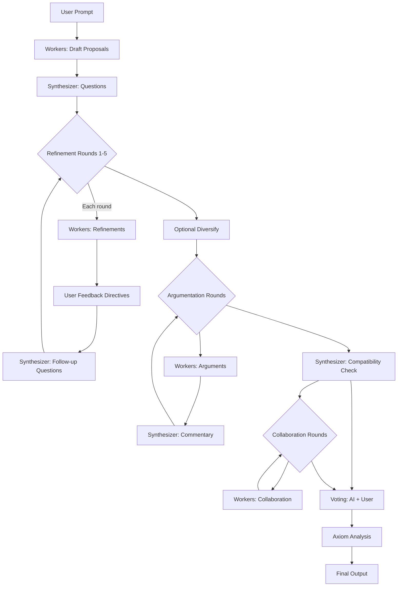

# AI Council

A local multi-agent LLM debate system where persona-driven workers generate diverse solutions, refine them through synthesis loops, and undergo collaborative AI + human voting.

```
User Prompt → Workers (2-4 personas) → Synthesizer Questions → 
Refinement Loops (1-5) → [Optional: Diversify] → Argumentation → 
Voting (AI + You + Feedback) → Final Output → Session Log (JSONL)
```

## Pipeline Overview



## Why This Exists

**Small models + structure + debate beats big models + vibes.**

Instead of asking one large model for an answer, AI Council runs multiple smaller models with different "thinking styles" (personas). They debate, refine, and compete - you pick the winner. The system learns which personas work best for you.

## Key Features

- **16GB / 32GB RAM Modes** - Works on consumer hardware (mode locked during active sessions)
- **Persona Discovery** - Extracts YOUR thinking styles from ChatGPT exports
- **Real-time UI** - Watch workers generate and debate with live session log
- **Configurable Debate** - Set refinement rounds (1-5), diversify workers mid-session
- **Comprehensive Voting** - AI scores + multi-level feedback (candidate, worker, synthesizer)
- **Session Management** - Persist through page refresh, proper End Council cleanup
- **Fine-tuning Ready** - Logs everything including all feedback for future LoRA training

## Hardware Requirements

| Component | Minimum | Recommended |
|-----------|---------|-------------|
| RAM | 16 GB | 32 GB |
| VRAM | 6 GB | 8 GB |
| Storage | 10 GB | 20 GB |
| GPU | NVIDIA (CUDA) | RTX 3060+ |

## Quick Start

```powershell
# 1. Install Python dependencies
pip install -r requirements.txt

# 2. Install Ollama (see RUN_GUIDE.md for details)
# Download from: https://ollama.com/download

# 3. Pull required models
ollama pull qwen2.5:3b
ollama pull qwen2.5:7b

# 4. Start AI Council
python run.py

# 5. Open browser
# http://127.0.0.1:5000
```

## Project Structure

```
AI Council/
├── app/                    # Flask application
│   ├── agents/            # Worker and Synthesizer
│   ├── models/            # Ollama integration
│   ├── personas/          # Persona management
│   ├── voting/            # Voting system
│   └── utils/             # Memory, logging
├── config/                # 16GB/32GB mode configs
├── scripts/               # Persona extraction tools
├── static/                # Frontend CSS/JS
├── templates/             # HTML templates
├── data/                  # Personas, sessions, exports
├── requirements.txt
├── run.py                 # Entry point
├── README.md              # This file
└── RUN_GUIDE.md          # Detailed setup guide
```

## Documentation

- **[RUN_GUIDE.md](RUN_GUIDE.md)** - Complete setup and usage instructions
- **[PROJECT_OVERVIEW.md](PROJECT_OVERVIEW.md)** - Full system architecture and features
- **[PERSONA_EXTRACTION_PLAN.md](PERSONA_EXTRACTION_PLAN.md)** - How persona discovery works
- **[Plan.md](Plan.md)** - Original technical design

## UI Features

| Feature | Description |
|---------|-------------|
| **Chat Timeline** | Chat-style message view showing worker discussions in real-time |
| **Multi-Round Argumentation** | Configurable argument rounds with synthesizer commentary |
| **Interactive Feedback** | Provide guidance after each refinement and argument round |
| **Conversation History** | Full discussion history visible in voting view |
| **Session Log** | Floating panel showing all pipeline events with timestamps |
| **Debate Rounds** | Configure 1-5 refinement loops before starting |
| **Argument Rounds** | Configure 1-3 argumentation rounds with counter-arguments |
| **Diversify** | Let workers see each other's proposals and differentiate |
| **End Council** | Properly end session, keeps logs, enables mode switching |
| **Multi-level Feedback** | Rate prompt, candidates, workers, synthesizer, and overall |
| **Session Persistence** | Survives page refresh (within browser tab) |
| **Mode Protection** | Can't change RAM mode during active session |

## RAM Modes

| Setting | 16GB Mode | 32GB Mode |
|---------|-----------|-----------|
| Workers | 2-3 | 3-4 |
| Worker Model | 3B (4-bit) | 3-4B (4-bit) |
| Synthesizer | 5-6B (4-bit) | 7-8B (4-bit) |
| Context Window | 2K / 4K | 4K / 8K |

Switch modes in the UI or set environment variable (only when no session is active):
```powershell
$env:AI_COUNCIL_RAM_MODE = "32GB"
```

## Persona Discovery

Extract your thinking styles from ChatGPT conversation exports:

```powershell
# Copy your export
copy conversations.json data\personas\raw_imports\

# Run discovery (finds 3-6 natural personas)
python scripts/extract_personas.py --mode 16GB

# Import into AI Council
python scripts/import_personas.py
```

The system analyzes your messages and discovers personas like:
- "Methodical Strategist" - systematic, planning-focused
- "Direct Builder" - code-focused, concise
- "Curious Explorer" - creative, question-asking

## Utilities

### JSONL Prettifier

Pretty-print session logs and other JSONL files for easier reading:

```powershell
# Prettify to stdout
python scripts/prettify_jsonl.py data/sessions/session-id.jsonl

# Save to file
python scripts/prettify_jsonl.py data/sessions/session-id.jsonl output.json

# Prettify ALL .jsonl files in the project (creates .json versions)
python scripts/prettify_jsonl.py --all

# Prettify all .jsonl files in a specific directory
python scripts/prettify_jsonl.py --directory data/sessions

# Prettify all .jsonl files in-place (overwrites originals - use with caution!)
python scripts/prettify_jsonl.py --all --in-place

# Dry run to see what would be processed
python scripts/prettify_jsonl.py --all --dry-run

# Filter by stage (e.g., only refinement entries)
python scripts/prettify_jsonl.py data/sessions/session-id.jsonl --stage refinement

# Output as compact JSON array
python scripts/prettify_jsonl.py data/sessions/session-id.jsonl --compact

# Show first 10 entries only
python scripts/prettify_jsonl.py data/sessions/session-id.jsonl --max-lines 10
```

## License

MIT License - Use freely, modify as needed.

## Acknowledgments

Built with:
- [Ollama](https://ollama.com/) - Local LLM runtime
- [Flask](https://flask.palletsprojects.com/) - Web framework
- [Qwen](https://qwenlm.github.io/) - Default models
